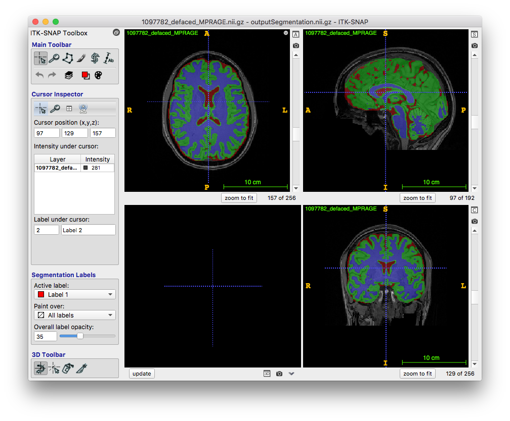

# App:  Brain Segmentation (patch-based)

Deep learning app made for patch-based T1-weighted MRI brain segmentation using ANTsRNet/ANTsPyNet

## Prerequisites

* [R](https://www.r-project.org) installation
* [ANTsR](https://github.com/ANTsX/ANTsR) installation
* [ANTsRNet](https://github.com/ANTsX/ANTsRNet) installation

or

* python3
* ANTsPy (https://github.com/ANTsX/ANTsPy) installation
* ANTsPyNet (https://github.com/ANTsX/ANTsPyNet) installation

## Model training notes

* Training data: IXI, NKI, Kirby, Oasis, ADNI SSTs
* Unet model (see ``Scripts/Training/``).
* Template-based data augmentation

## Sample prediction usage (ANTsRNet)

```
#
#  Usage:
#    Rscript doBrainSegmentation.R inputImage inputImageBrainExtractionMask outputImagePrefix
#

$ Rscript Scripts/doBrainTissueSegmentation.R Data/Example/1097782_defaced_MPRAGE.nii.gz Data/Example/1097782_defaced_MPRAGEBrainExtractionMask.nii.gz output

*** Successfully loaded .Rprofile ***

Loading required package: ANTsRCore

Attaching package: ‘ANTsRCore’

The following object is masked from ‘package:stats’:

    var

The following objects are masked from ‘package:base’:

    all, any, apply, max, min, prod, range, sum

Using TensorFlow backend.
Loading weights file2019-02-04 15:36:46.214289: I tensorflow/stream_executor/cuda/cuda_gpu_executor.cc:857] OS X does not support NUMA - returning NUMA node zero
2019-02-04 15:36:46.214466: I tensorflow/core/common_runtime/gpu/gpu_device.cc:955] Found device 0 with properties:
name: TITAN Xp
major: 6 minor: 1 memoryClockRate (GHz) 1.582
pciBusID 0000:c3:00.0
Total memory: 12.00GiB
Free memory: 10.62GiB
2019-02-04 15:36:46.214484: I tensorflow/core/common_runtime/gpu/gpu_device.cc:976] DMA: 0
2019-02-04 15:36:46.214493: I tensorflow/core/common_runtime/gpu/gpu_device.cc:986] 0:   Y
2019-02-04 15:36:46.214512: I tensorflow/core/common_runtime/gpu/gpu_device.cc:1045] Creating TensorFlow device (/gpu:0) -> (device: 0, name: TITAN Xp, pci bus id: 0000:c3:00.0)
2019-02-04 15:36:46.214882: E tensorflow/stream_executor/cuda/cuda_driver.cc:924] failed to allocate 10.09G (10830902272 bytes) from device: CUDA_ERROR_OUT_OF_MEMORY
  (elapsed time: 1.060265 seconds)
Reading  Data/Example/1097782_defaced_MPRAGE.nii.gz  (elapsed time: 0.8865328 seconds)
Extracting patches based on mask.  (elapsed time: 3.736066 seconds)
968/968 [==============================] - 15s 15ms/step
 (elapsed time: 26.59697 seconds)
Reconstruct from patches and write to disk.  (elapsed time: 36.7814 seconds)

Total elapsed time: 1.133395 seconds

```

## Sample prediction usage (ANTsPyNet)

```
#
#  Usage:
#    python doBrainSegmentation.py inputImage inputImageBrainExtractionMask outputImagePrefix
#

$ python3 Scripts/doBrainTissueSegmentation.py Data/Example/1097782_defaced_MPRAGE.nii.gz Data/Example/1097782_defaced_MPRAGEBrainExtractionMask.nii.gz output

Using TensorFlow backend.
Create u-net model.
Loading weights file
  (elapsed time:  0.226729154586792  seconds)
Reading  Data/Example/1097782_defaced_MPRAGE.nii.gz
  (elapsed time:  0.5151350498199463  seconds)
Extracting patches based on mask.
  (elapsed time:  0.7056849002838135  seconds)
Prediction and decoding
968/968 [==============================] - 114s 117ms/step
  (elapsed time:  113.67524600028992  seconds)
Reconstruct from patches and write to disk.
  (elapsed time:  3.8899519443511963  seconds)
Writing Csf
  (elapsed time:  1.315173864364624  seconds)
Writing GrayMatter
  (elapsed time:  1.2296578884124756  seconds)
Writing WhiteMatter
  (elapsed time:  1.2796859741210938  seconds)
Total elapsed time:  123.48455905914307 seconds
```


## Sample results


